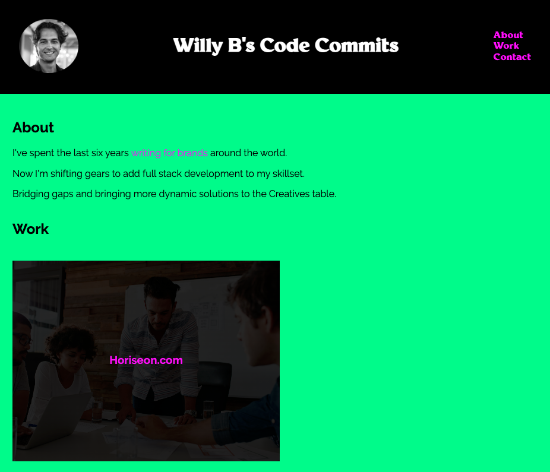

# Willy B's Code Commits

After giving this project much consideration, I decided to designate my portfolio site as a space to explore works in progress. Adopting a more personal take on a professional portfolio.

The more I learn and develop, the further this site will evolve into a gallery of finished, usable, consumer-facing products.

But for now, it will help me unpack class materials, instructor feedback and "aha" moments to come.

That being said, please note that any "snapshot" of my portfolio—current or future—is a work in progress.

As specified in the Challenge Acceptance Criteria, the site includes the following:

✨ Photo, name and links to sections about me, my work, and how to contact me.

✨ Links in the navigation scroll to the corresponding sections.

✨ The first application's image, which is larger in size than the others.

✨ The title of the first application, which takes you to the deployed application.

✨ A responsive layout that adapts to a variety of viewports.

Below is a screenshot of my latest and greatest:

To take it for a spin, visit https://willbrennana.github.io/02_portfolio/ 

